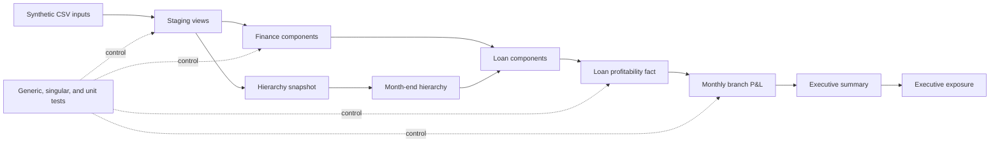
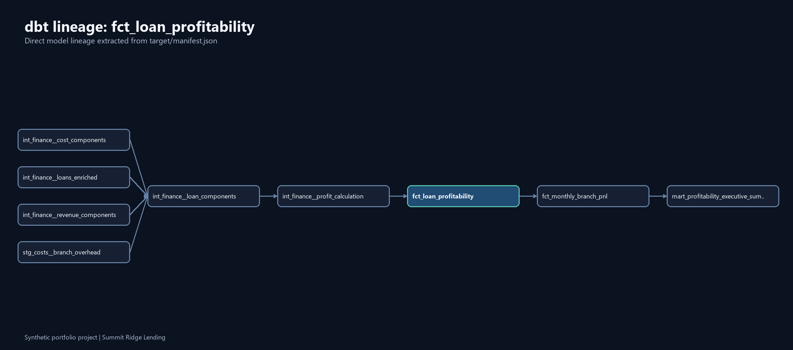
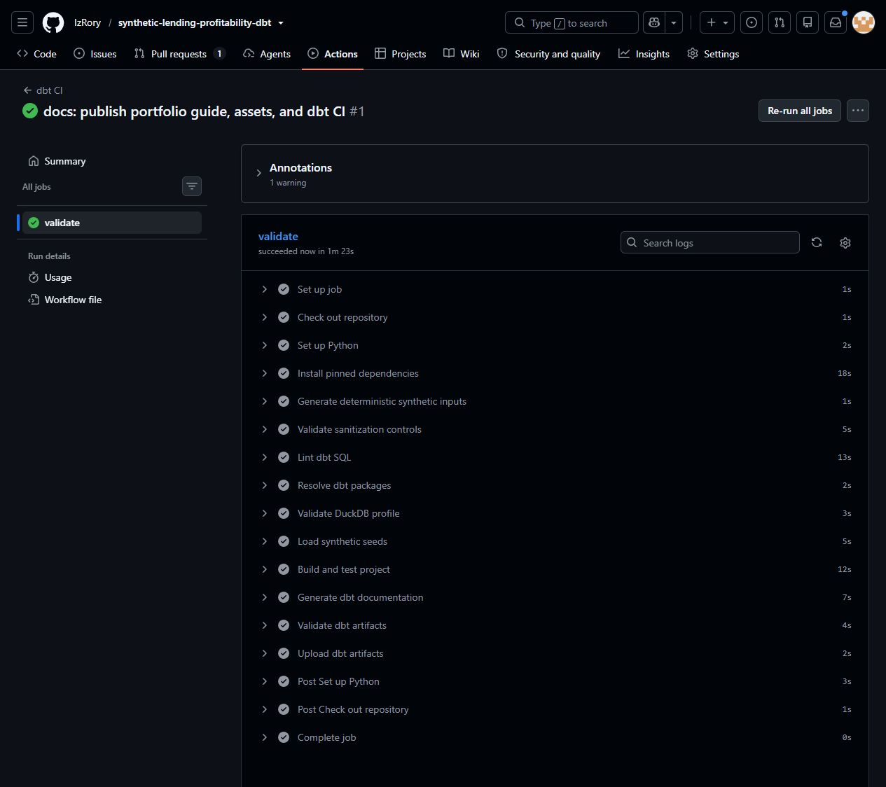
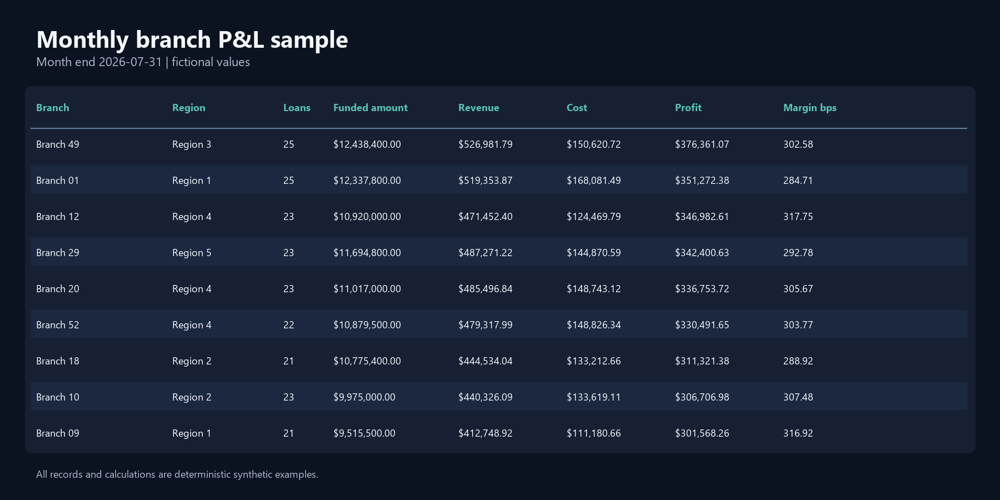

# Summit Ridge Lending Profitability Analytics

> [!IMPORTANT]
> Every record, organization, identifier, amount, and calculation in this repository is fictional. This independent portfolio project uses synthetic data and simplified business rules to demonstrate analytics engineering practices. It contains no employer or customer data, source code, schemas, formulas, credentials, or documentation.

Summit Ridge Lending needs a consistent way to trace synthetic loan revenue and costs into branch and regional P&L. This project starts with deterministic operational fixtures, resolves effective-dated branch assignments, calculates loan-level profitability, reconciles finance controls, and publishes two reporting marts in DuckDB.

[](https://github.com/IzRory/synthetic-lending-profitability-dbt/actions/workflows/dbt-ci.yml)

| Dataset fact | Verified value |
| --- | ---: |
| Funded loans | 25,000 |
| Branches and regions | 60 branches, 8 regions |
| Reporting window | 24 month ends, August 2024 through July 2026 |
| Final mart rows | 25,000 loan, 1,440 branch-month, 216 executive-summary |

Core controls cover funded amount, funded-loan count, partner statements, component completeness, hierarchy assignment, dimension keys, profit equations, and broad fictional margin bounds. The clean build runs 243 data tests and 3 native dbt unit tests.

[Inspect the dbt lineage](assets/dbt-lineage.png) | [View a sample branch P&L](assets/sample-profitability-output.png) | [See the passing CI run](assets/ci-passing.png)

## Architecture



The required runtime is local DuckDB. Static seeds land in `analytics_raw`; dbt builds staging, intermediate, snapshot, dimensional, and mart relations in `analytics`. [Architecture details](docs/architecture.md) explain the design and materializations.



## Model layers

| Layer | Purpose | Example grain |
| --- | --- | --- |
| Synthetic inputs | Fixed-seed operational and finance fixtures | One row per funded loan |
| Staging | Explicit types, blank-to-null cleanup, category normalization | Source grain preserved |
| Snapshot and organization | Historical branch records and month-end as-of resolution | One branch per loan month end |
| Intermediate finance | Reusable revenue, cost, allocation, and reconciliation components | One row per loan or control grain |
| Dimensions | Current branch, program, and partner attributes | One row per business key |
| Marts | Loan fact, branch P&L, and region/company executive summary | Loan, branch-month, region-month |

The [data dictionary](docs/data_dictionary.md) records each input grain, key, row behavior, and null policy. dbt YAML contains model and final-column descriptions for generated documentation.

## Fictional financial calculations

```text
base_revenue = funded_amount * base_margin_bps / 10,000
total_revenue = base_revenue + origination_fee_amount
              + partner_revenue_amount + margin_adjustment_amount
direct_cost = commission_amount + override_amount
            + credit_cost_amount + trueup_amount
allocated_operating_cost = monthly_branch_overhead / monthly_branch_funded_loan_count
total_cost = direct_cost + allocated_operating_cost
profit_amount = total_revenue - total_cost
profit_margin_bps = profit_amount / funded_amount * 10,000
```

`safe_divide` returns null when a denominator is zero. Intermediate models retain calculation precision; final presentation models round currency to cents. These rules are demonstration logic, not production lending policy. [Business rules](docs/business_rules.md) list the assumptions and defaults.

## Reconciliation and testing

The project uses four test types:

- Built-in generic tests cover primary keys, foreign keys, accepted values, and nulls.
- Custom generic tests check positive measures, valid month ends, and composite uniqueness.
- Eight singular finance tests return failing rows for control breaks.
- Three native unit tests isolate the profit equation, partner revenue assignment, and hierarchy selection.

The funding statement and partner statement fixtures come from the same fixed-seed loan population, so the default data reconciles to zero. Run `scripts/demonstrate_failures.ps1` to build an isolated defect fixture with a duplicate loan, bad funding total, and orphaned program. The script expects the three corresponding tests to fail and leaves the clean seeds unchanged. [Reconciliation controls](docs/reconciliation_controls.md) maps each assertion to its tolerance and failure signal.

## Local quick start

Prerequisites: Python 3.11 or newer and Git. The verified environment uses Python 3.13.1.

```powershell
git clone https://github.com/IzRory/synthetic-lending-profitability-dbt.git
cd synthetic-lending-profitability-dbt
python -m venv .venv
.\.venv\Scripts\python.exe -m pip install --upgrade pip
.\.venv\Scripts\python.exe -m pip install -r requirements.txt
.\.venv\Scripts\python.exe scripts\generate_synthetic_data.py
$env:DBT_PROFILES_DIR = "profiles"
.\.venv\Scripts\dbt.exe deps
.\.venv\Scripts\dbt.exe debug --target ci
.\.venv\Scripts\dbt.exe seed --target ci --full-refresh
.\.venv\Scripts\dbt.exe build --target ci --fail-fast
```

Run the final validation sequence:

```powershell
.\.venv\Scripts\python.exe scripts\validate_no_sensitive_terms.py
.\.venv\Scripts\sqlfluff.exe lint models analyses snapshots tests
.\.venv\Scripts\dbt.exe docs generate --target ci
.\.venv\Scripts\python.exe scripts\check_dbt_artifacts.py
```

`setup.ps1` performs the install, generation, and clean build on Windows. The generator accepts `--row-count`, `--start-date`, `--end-date`, `--output-dir`, and `--seed`. Re-running it with the same arguments produces byte-identical CSV files.

### Incremental fact demonstration

The loan fact uses `loan_id` as its unique key and `source_updated_at` as its incremental boundary.

```powershell
.\.venv\Scripts\dbt.exe run --select fct_loan_profitability --target ci --full-refresh
.\.venv\Scripts\dbt.exe run --select fct_loan_profitability --target ci
```

The first command creates 25,000 rows. The second command exercises the incremental path and retains 25,000 rows because the fixed source contains no newer updates.

## CI workflow

`.github/workflows/dbt-ci.yml` runs on pull requests and pushes to `main`. It installs pinned packages, regenerates the data, runs sanitization and SQLFluff, validates the DuckDB profile, seeds and builds dbt, generates documentation, checks artifacts, and uploads short-retention evidence. The artifact checker fails when required marts or tests are missing, a dbt node fails, final documentation is incomplete, or the repository fails its sanitization scan.



## Fictional example findings

These observations describe the generated fixture only:

- Summit Conventional 01 has the lowest aggregate profit margin at 182.30 basis points, consistent with its position at the low end of the fictional base-margin schedule.
- Summit Region 5 records the largest month-over-month margin decline in April 2025, down 62.80 basis points with a $723,949.76 profit decrease. The variance is a useful review trigger in the executive mart.
- Juniper Home Partners contributes the most partner revenue at $3,236,132.82 across 1,846 synthetic loans, averaging $1,753.05 per partnered loan. Its statement controls reconcile to zero variance.



## Repository walkthrough

- `scripts/generate_synthetic_data.py` creates the deterministic fixtures.
- `models/staging` standardizes each lending, partner, and cost input.
- `snapshots` and `models/intermediate/organization` preserve and resolve historical hierarchy assignments.
- `models/intermediate/finance` calculates reusable components and control totals.
- `models/marts` publishes dimensions, the incremental loan fact, branch P&L, and executive summary.
- `tests` contains the finance assertions; model YAML holds generic and unit tests.
- `analyses` provides ad hoc branch and reconciliation review queries.
- `docs` records design choices, definitions, controls, and the reviewer path.

The [project walkthrough](docs/project_walkthrough.md) gives a ten-minute review sequence.

## Optional Snowflake path

The repository does not claim a verified Snowflake build. `.env.example` reserves standard variable names for a future personal target, but the required DuckDB build has no credentials or cloud cost. A future Snowflake implementation should add `dbt-snowflake`, create a separate environment-variable profile, use an auto-suspending warehouse, execute the full build in a personal account, and document schema cleanup before adding Snowflake to the technology claims.

## Limitations and next work

The data generator models funded loans only, overhead uses an equal loan-count allocation, partner statements arrive once per loan, and exchange rates or servicing cash flows are out of scope. The snapshot demonstrates history across source changes, but this fixed release contains one generated version of each effective period. Useful extensions include late-arriving adjustments, multiple currencies, source-contract enforcement, and a separately verified Snowflake target.

## Resume-ready summary

> Built an end-to-end synthetic lending profitability data product in dbt, modeling 25,000 loans across staged, intermediate, dimensional, and mart layers with automated financial reconciliations, documentation, and GitHub Actions CI.

> Implemented generic, singular, and unit tests for funding totals, loan counts, partner statements, component completeness, effective-dated hierarchies, and profit calculations, producing a reproducible green `dbt build` from a clean environment.

## License

MIT
